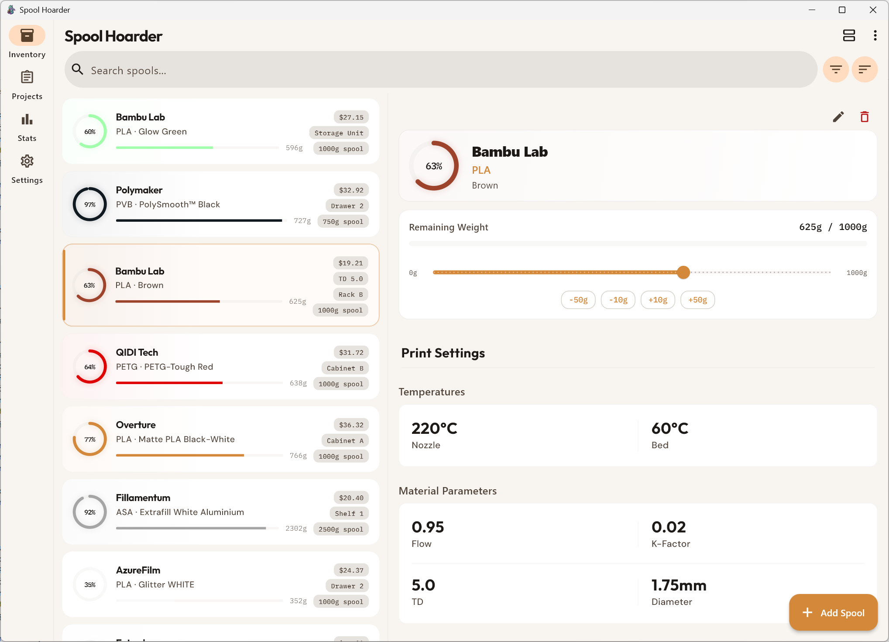

  

# Spool Hoarder

Spool Hoarder is a filament inventory and usage tracking app for serious 3D printing.

It gives you full visibility into what you own, how much is left, what it's worth, and where it's being used.

No spreadsheets. No guessing. No duplicate purchases.

---

## Inventory Overview

Track every spool in one place.

  

- Brand, material, and color
- Remaining weight with visual progress indicator
- Storage location
- Spool size (1kg, 750g, etc.)
- Purchase price
- Technical parameters (flow ratio, K-factor, diameter, extruder/bed temperatures, transmission distance)

You can see at a glance which spools are full, low, or nearly depleted.

---

## Precise Weight Tracking

Each spool includes a live remaining-weight slider.

- Adjust usage in seconds
- Quick-adjust buttons (−50g, −10g, +10g, +50g)
- See exact grams remaining
- Prevent accidental overuse

No mental math required.

---

## AI-Powered Spool Recognition

Point your camera at a spool. Spool Hoarder does the rest.

- Photograph a spool label to extract brand, material, name, color, hex codes, diameter, and temperatures automatically
- Supports Google Gemini, Anthropic Claude, and OpenAI vision APIs
- API keys stored securely in the system keychain
- Extracted data populates the Add Spool form for your review before saving
- Brand and material names are normalized against the global filament catalog after scanning

---

## Batch Scanning

Scan an entire shelf of spools without slowing down.

- Live camera preview with per-spool scan feedback
- On-device OCR for iOS and macOS (no internet required for supported devices)
- Review all scanned results at once with confidence indicators
- Edit any entry before bulk-adding to inventory

Scan a box of twenty spools in minutes, not hours.

---

## SpoolmanDB Integration

Spool Hoarder connects to the SpoolmanDB global filament catalog.

- Brand and material autocomplete pulls from thousands of real products
- Selecting a filament auto-fills hex color codes, diameter, density, and temperature ranges
- CSV imports are automatically normalized: casing corrected, missing fields filled from catalog data
- Catalog is cached locally and works offline; refreshed in the background when stale

---

## Project-Based Usage Logging

  

Track filament usage per project.

- Assign multiple filament specifications to a project (brand, material, color, required weight)
- Log exact grams consumed per spool
- Automatic inventory deduction — spool weight updates immediately
- Visual warnings when a selected spool doesn't match a project's target filament
- Usage history with date, spool, and grams per entry
- Project status tracking (active, complete, paused)
- Total weight consumed displayed per project

Every print becomes documented. Every gram accounted for.

---

## Smart Search, Filter, and Sort

Find any spool instantly.

- Full-text search across brand, material, name, notes, and features
- Filter by material, color family, brand, diameter, and depleted status
- Filter counts show how many spools match each option (e.g. "PLA (15)")
- Sort by brand, material, color family, weight, price, or date added
- Sort direction toggles with a second tap

---

## Inventory Grouping

View your inventory the way that makes sense for your setup.

- **Flat** — every spool listed individually
- **Product** — identical filaments grouped into expandable cards with combined weight
- **State** — groups by spool status (full, partial, depleted)

Switch modes from the inventory screen or set a default in Settings.

---

## Statistics & Cost Analysis

  

Spool Hoarder doesn't just track weight. It shows the big picture.

- Total spool count
- Active vs depleted inventory
- Total inventory value
- Total remaining weight in kg and lbs
- Average cost per kg and per gram
- Value and weight breakdown by material
- Low-stock warnings

You know not just what you have — but what it's worth.

---

## CSV Import & Export

Your data, your way.

- Export your full inventory to a standards-compliant CSV file
- Import from a CSV to restore or migrate data
- Import preview shows exactly what will be added or updated before you commit
- Conflict detection flags spools that would be overwritten
- Per-row error reporting surfaces problems without failing the whole import
- Works with files exported from other tracking tools

---

## Customizable Display

Configure Spool Hoarder to match your workflow.

- Choose which fields appear on spool cards: price, temperatures, location, size, diameter, features, and more
- Set a default spool size used when adding new spools
- Dark mode with System / Light / Dark toggle

---

## Platforms

- Windows
- macOS
- iOS

Availability may vary by platform.

---

## Why Spool Hoarder?

Because filament adds up.

Weight.
Cost.
Storage space.

Spool Hoarder gives you control over all three.
