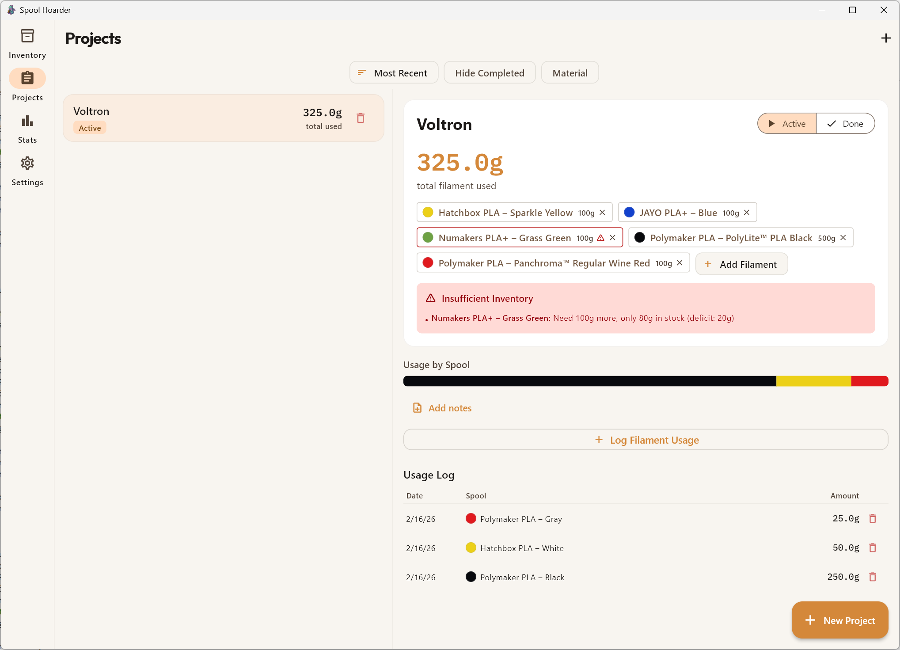
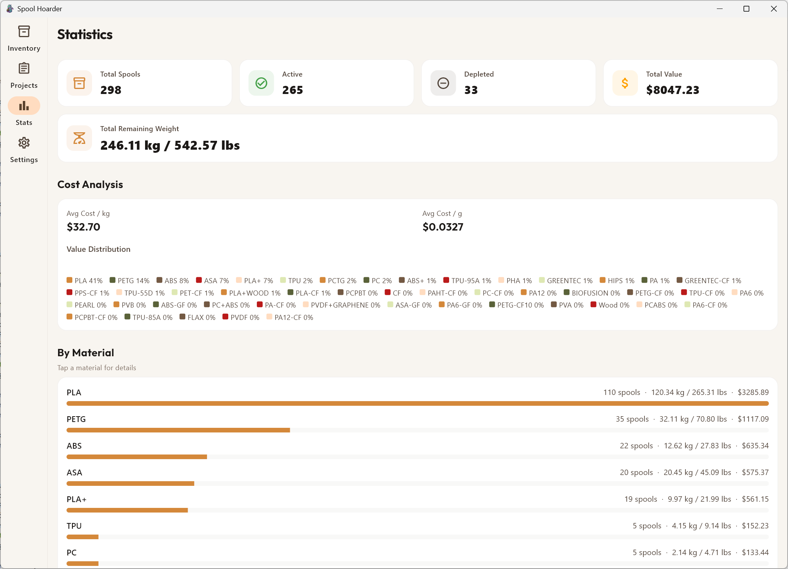

  

# SpoolHoarder

SpoolHoarder is a filament inventory and usage tracking app for serious 3D printing.

It gives you full visibility into what you own, how much is left, what it’s worth, and where it’s being used.

No spreadsheets. No guessing. No duplicate purchases.

---

## Inventory Overview

Track every spool in one place.

  

- Brand, material, and color
- Remaining weight with visual progress indicator
- Storage location
- Spool size (1kg, 750g, etc.)
- Purchase price
- Technical parameters (flow, K-factor, diameter)

You can see at a glance which spools are full, low, or nearly depleted.

---

## Precise Weight Tracking

Each spool includes a live remaining-weight slider.

- Adjust usage in seconds
- Add or subtract weight quickly
- See exact grams remaining
- Prevent accidental overuse

No mental math required.

---

## Project-Based Usage Logging

  

Track filament usage per project.

- Assign multiple spools to a project
- Log exact grams consumed
- Automatic inventory deduction
- Usage history per spool
- Clear warnings for insufficient inventory

Every print becomes documented.  
Every gram accounted for.

---

## Statistics & Cost Analysis

  

SpoolHoarder doesn’t just track weight. It shows the big picture.

- Total spool count
- Active vs depleted inventory
- Total inventory value
- Total remaining weight (kg and lbs)
- Average cost per kg and per gram
- Value distribution by material
- Breakdown by material type

You know not just what you have — but what it’s worth.

---

## Material Breakdown

See your inventory grouped by material:

- Spool count per material
- Total weight per material
- Total value per material

Quick insight into how much PLA, PETG, ABS, ASA, and more you actually stock.

---

## Designed for Makers with Real Inventory

SpoolHoarder is built for:

- Print farms
- High-volume hobbyists
- Workshop environments
- Anyone managing more than a few rolls

It scales from a handful of spools to hundreds without becoming cluttered.

---

## Platforms

- Windows
- macOS
- iOS
- Web

Availability may vary by platform.

---

## Why SpoolHoarder?

Because filament adds up.

Weight.  
Cost.  
Storage space.  

SpoolHoarder gives you control over all three.

